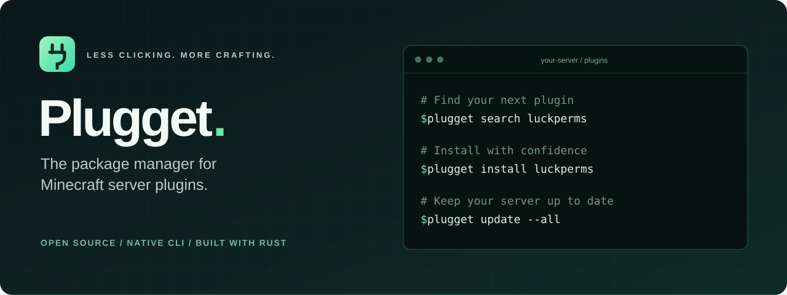

<p align="center">
  
</p>

<p align="center">
  <a href="https://github.com/byalex33/plugget/actions/workflows/ci.yml"></a>
  <a href="LICENSE"></a>
  <a href="Cargo.toml"></a>
  <a href="#compatibility"></a>
</p>

<p align="center">
  <strong>Find it. Install it. Keep it updated.</strong><br>
  A focused, open-source CLI for managing your Minecraft server's plugins.
</p>

<p align="center">
  <a href="#quick-start">Quick start</a> ·
  <a href="#installation">Installation</a> ·
  <a href="docs/guide.md">User guide</a> ·
  <a href="https://github.com/byalex33/plugget/issues">Report an issue</a> ·
  <a href="#contributing">Contribute</a>
</p>

---

## Your plugins, one command away

Plugget brings the familiar package-manager workflow to Minecraft servers.
Search Modrinth, install the right release for your server, and update your
managed plugins from the terminal — with checksums, dependency tracking, and
recoverable changes built in.

```sh
plugget search luckperms
plugget install luckperms
plugget update --all
```

| Built for server admins | What that means |
| :--- | :--- |
| **Compatibility comes first** | Selects releases for your Minecraft version and server platform. Stable releases are the default. |
| **Verified before installation** | Checks download size, SHA512, and JAR structure before publishing a plugin. |
| **Your files stay yours** | Tracks project IDs and exact owned files. Unmanaged plugins remain untouched. |
| **Updates with a recovery path** | Stages replacements, retains the old JAR until commit, and journals interrupted changes. |
| **Dependencies included** | Plans required Modrinth dependencies and asks before installing them. |
| **Ready for scripts** | Clean JSON, predictable exit codes, and noninteractive confirmations. |

> [!NOTE]
> **Early release · v0.1.0.** The Windows build and live Modrinth workflows have
> been verified. Native CI and release packaging cover Windows, Linux, and macOS;
> cross-platform validation is still in progress. See the [verification report](VERIFICATION.md).

## Quick start

From your server's root directory:

```sh
# Set up Plugget for this server.
plugget init

# Find a plugin and inspect its compatible release.
plugget search luckperms
plugget info luckperms

# Install it, then check what you manage.
plugget install luckperms
plugget list

# Review available updates before applying them.
plugget outdated
plugget update --all
```

If detection needs a little help, specify your server explicitly:

```sh
plugget init --platform paper --minecraft 1.21.11
```

When detection is unambiguous, you can go straight to `plugget install`.
Plugget creates its local configuration automatically.

> [!IMPORTANT]
> Stop your Minecraft server before changing plugins, then restart it afterward.
> Plugget manages files on disk; it does not hot-load or unload plugins.

## Installation

**Build from source today** with [Rust](https://www.rust-lang.org/tools/install)
1.88 or newer:

```sh
git clone https://github.com/byalex33/plugget.git
cd plugget
cargo install --path . --locked
plugget --help
```

Cargo installs the executable into its `bin` directory. Make sure that directory
is on your `PATH`.

Prefer a standalone executable? Run `cargo build --release` and copy
`target/release/plugget` — `plugget.exe` on Windows — to a directory on your
`PATH`. Rust is only needed to build it.

<details>
<summary><strong>Prebuilt binaries and package managers</strong></summary>

The [release workflow](.github/workflows/release.yml) prepares archives and
SHA256 checksums for these targets:

| System | Architectures | Archive |
| :--- | :--- | :--- |
| Windows | x86_64, ARM64 | `.zip` |
| Linux | x86_64, ARM64 | `.tar.gz` |
| macOS | Intel, Apple Silicon | `.tar.gz` |

Prebuilt releases have not been published yet. When available, they will appear
on the [Releases page](https://github.com/byalex33/plugget/releases). Verify the
archive's SHA256 before installing. The current Linux packaging targets glibc
2.39 or newer.

Distribution through winget, Homebrew, Scoop, Chocolatey, AUR, and crates.io is
planned. No registry package is currently published.

</details>

## The command toolkit

| Command | What it does |
| :--- | :--- |
| `plugget init` | Detect your server and create Plugget metadata. |
| `plugget search <query>` | Find server plugins on Modrinth. |
| `plugget info <plugin>` | Show authors, compatibility, versions, and dependencies. |
| `plugget install <plugin>` | Install a plugin and its required dependencies. |
| `plugget list` | List managed plugins and show unmanaged JARs separately. |
| `plugget outdated` | Check for newer compatible releases. |
| `plugget update <plugin>` | Update one managed plugin. |
| `plugget update --all` | Update all managed plugins and report individual failures. |
| `plugget remove <plugin>` | Move a managed JAR to the Recycle Bin or Trash. |
| `plugget doctor` | Diagnose configuration, integrity, duplicate JARs, and connectivity. |
| `plugget version` | Show the installed Plugget version. |

`plugget update` without a name also updates all managed plugins.
Use `plugget <command> --help` for every available option.

<details>
<summary><strong>Useful recipes</strong></summary>

```sh
# Search a phrase and return more results.
plugget search "world edit" --limit 20

# Install an exact version ID or version number.
plugget install luckperms --version VERSION_ID

# Explicitly allow compatible alpha and beta releases.
plugget install chunky --prerelease

# Approve installation and required dependencies without a prompt.
plugget install luckperms --yes

# Produce one machine-readable result.
plugget update --all --yes --json

# Check local integrity without making a network request.
plugget doctor --offline
```

Global options: `--quiet`, `--verbose`, `--json`, `--yes` / `-y`, and `--no-color`.
`--json` disables prompts. Noninteractive mutations require `--yes`.

Exact slugs and project IDs resolve directly. Fuzzy matches require explicit
selection; `--yes` never silently chooses a similarly named project.

</details>

## Compatibility

Plugget understands the relationship between server platforms:

| Your server | Accepted plugin loaders |
| :--- | :--- |
| **Paper** | `paper`, `spigot`, `bukkit` |
| **Purpur** | `purpur`, `paper`, `spigot`, `bukkit` |
| **Spigot** | `spigot`, `bukkit` |
| **Bukkit / CraftBukkit** | `bukkit` |

A Bukkit plugin can be selected for Paper. A Paper-only plugin is not assumed
to work on Spigot. Minecraft versions match upstream metadata exactly, and
incompatible releases are excluded from update checks.

**Modrinth is the supported source for v0.1.** Spigot, Hangar, and GitHub Releases
providers are planned. Folia, Fabric, Forge, and Vanilla servers are outside the
current supported scope.

Compatibility metadata comes from upstream authors and cannot guarantee that a
plugin will work correctly on your server.

## Designed to respect your server

Plugget keeps configuration and package identities in `.plugget/`, alongside
your existing `plugins/` directory:

```text
your-server/
├── server.properties
├── plugins/
│   ├── LuckPerms-Bukkit-….jar
│   └── YourPrivatePlugin.jar
└── .plugget/
    ├── config.toml
    ├── lock.json
    └── process.lock
```

**Existing JARs remain unmanaged.** Initialization counts them without adopting
or replacing them. Removal only acts on an exact, checksum-verified file that
Plugget owns, and retains the plugin's configuration and data directories.

**Changes are recoverable.** Downloads are staged before installation, a process
lock prevents overlapping Plugget mutations, and a journal supports rollback or
recovery after interruption. Obsolete files go to the OS Recycle Bin or Trash.

A local filesystem with hard-link and atomic-rename support is required.
If Trash is unavailable, Plugget reports the failure and retains recovery data;
there is no permanent-delete fallback. Keep normal server backups.

Read the [configuration, recovery, and scripting guide](docs/guide.md) for global
config locations, dependency rules, JSON responses, and exit codes.

## Contributing

Plugget is **MIT-licensed** and open to contributions. Bug reports, documentation
improvements, compatibility fixtures, and focused fixes are welcome.

1. [Open an issue](https://github.com/byalex33/plugget/issues) with the problem or
   proposed change. For bugs, include your OS, Plugget version, server platform,
   Minecraft version, and the command that failed. Remove private details from logs.
2. Fork the repository and make your change on a branch. Discuss larger features
   before investing in an implementation.
3. Run the checks below, then [open a pull request](https://github.com/byalex33/plugget/pulls)
   describing the change and how you verified it.

```sh
cargo fmt --check
cargo clippy --all-targets --all-features -- -D warnings
cargo test --all
cargo build --release
```

The code separates CLI workflows, server detection, providers, dependency
resolution, networking, and filesystem state. Start with the
[architecture and verification report](VERIFICATION.md) to find the right module.

For a suspected vulnerability, use GitHub's
[private vulnerability reporting](https://github.com/byalex33/plugget/security/advisories/new)
instead of posting exploit details in a public issue.

## What's next

- **Release validation:** exercise every native target and prepare reviewed binaries.
- **Existing-server adoption:** identify existing JARs by hash, with explicit confirmation.
- **More sources:** add providers while keeping the installation workflow consistent.
- **Easier installation:** package-manager distribution after release validation.

The focus stays on a reliable local CLI. Import, declarative manifests, and sync
are future work. There are no accounts, telemetry, or Minecraft-side components.

---

<p align="center">
  <strong>Plugget</strong> · <a href="LICENSE">MIT licensed</a> · <a href="https://plugget.dev">plugget.dev</a><br>
  <sub>Not affiliated with Mojang, Microsoft, PaperMC, or Modrinth.</sub>
</p>
